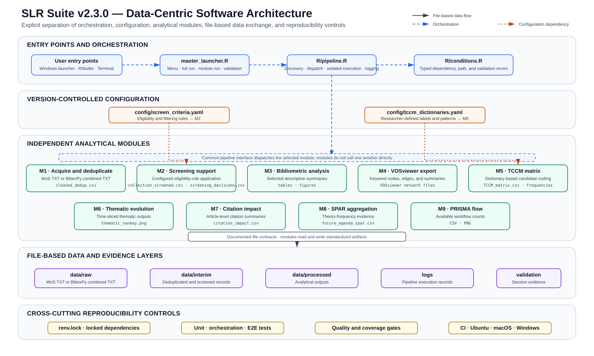

SLR Suite separates orchestration, analysis, configuration, evidence, and reporting.

{fig-alt="Data-centric architecture of SLR Suite version 2.3.0 showing entry points, orchestration, version-controlled configuration, nine independent analytical modules, file-based data layers, and cross-cutting reproducibility controls."}

| Layer | Location | Responsibility |
|---|---|---|
| Orchestration | `R/pipeline.R`, `master_launcher.R` | Discover and execute isolated pipeline steps; record outcomes |
| Analysis | `scripts/` | Numbered, independently runnable transformations |
| Protocol | `config/` | Search, screening, and coding decisions |
| Evidence | `data/` | Raw input, interim decisions, and processed outputs |
| Validation | `tests/`, `experiments/` | Regression checks and reproducibility evidence |
| Reporting | `docs/` | User documentation and manuscript |

Each step runs in a new environment. The launcher does not clear the user's global workspace or install packages. Failures stop the pipeline and are recorded with duration and error text.

## Ordered analysis modules

| ID | Script | Responsibility |
|---|---|---|
| M1 | `01_acquire_and_dedupe.R` | Import and deduplicate records |
| M2 | `02_screening.R` | Apply screening workflow |
| M3 | `03_biblio_analysis.R` | Produce core bibliometric summaries |
| M4 | `04_vosviewer_export.R` | Export VOSviewer networks |
| M5 | `05_tccm_matrix.R` | Construct the TCCM matrix |
| M6 | `06_thematic_evolution.R` | Analyse thematic evolution |
| M7 | `07_citation_impact.R` | Summarize citation impact |
| M8 | `08_future_agenda_SPAR.R` | Build the SPAR future-agenda table |
| M9 | `09_prisma_flow.R` | Produce PRISMA flow evidence |

The complete input/output/test mapping is in `docs/quality/software-documentation-traceability.md`.
